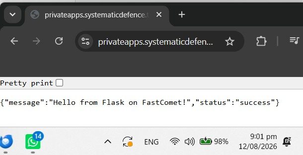

# Sample Python Server

## 1.0 Setup

### 1.1 Local
~/eclipse-workspace/MicronManagement] └─$ python3 -m venv venv

~/eclipse-workspace/MicronManagement] └─$ source venv/bin/activate

~/eclipse-workspace/MicronManagement] └─$ pip install -r requirements.txt

#### a. Start server

~/eclipse-workspace/MicronManagement] └─$ uvicorn main:app --reload --port 8002


#### b. Run

i. Navigate to :

http://127.0.0.1:8002


### 1.2 Fastcomet

To deploy FastAPI on FastComet Shared Hosting, app needs to be adapted because FastComet uses Phusion Passenger (which is built for WSGI apps), while FastAPI is an asynchronous framework (ASGI). [1] The most reliable way to make them work together without process being killed by the server is to use a tool called a2wsgi to wrap your FastAPI app so Passenger can read it. 

FastAPI is built on ASGI (Asynchronous Server Gateway Interface), which inherently conflicts with standard cPanel environments like FastComet's LiteSpeed wrapper (lswsgi). Shared hosting is designed from the ground up for WSGI (Web Server Gateway Interface), which is synchronous. Trying to bridge ASGI to WSGI on these platforms frequently causes the 503 timeouts and process-limit erro. [2, 3, 4] 

Flask is a native WSGI micro-framework [1]. It works beautifully on FastComet out of the box because it matches the exact architecture the server expects. It has a lightweight routing syntax very similar to FastAPI. [5, 6, 7] 
 

#### 1.2.1 Exact Folder Structure 

Your project code should live outside of the public_html directory for security. This prevents users from accidentally downloading your raw code files or .env configurations. 

/home/yourusername/ 

```txt
├── private_apps/            <-- Create this folder manually 

│   └── server/           <-- Your application root directory 

│       ├── main.py          <-- Your main FastAPI file 

│       ├── passenger_wsgi.py <-- The entry point cPanel looks for 

│       └── requirements.txt <-- Your dependencies file 

└── public_html/             <-- FastComet's public folder 

    └── (cPanel creates symlinks or files here automatically) 

 ```

 
#### 1.2.2 Files

##### 1.2.2.1 requirements.txt 

Place this in /home/yourusername/private_apps/server/ folder. Do not use a broad pip freeze from Kali. Instead, use these specific packages:

 ```txt

fastapi 

a2wsgi 

uvicorn 

flask 

```

##### 1.2.2.2. main.py 

This is your standard Flask logic.  

```python
from flask import Flask, jsonify, request

# 1. Initialize the native WSGI application
app = Flask(__name__)

@app.route("/")
def read_root():
    return jsonify({"status": "success", "message": "Hello from Flask on FastComet!"})

@app.route("/items/<int:item_id>")
def read_item(item_id):
    # Retrieve the query parameters (equivalent to q: str = None in FastAPI)
    q = request.args.get('q', None)
    return jsonify({"item_id": item_id, "q": q})

# 2. Expose the exact object cPanel expects to run the website
application = app
```
 

##### 1.2.2.3 passenger_wsgi.py 

This is the critical bridge - an adapter.

 ```python
import imp
import os
import sys


sys.path.insert(0, os.path.dirname(__file__))

wsgi = imp.load_source('wsgi', 'passenger_wsgi.py')
application = wsgi.application
```

 

### 1.2.3 Steps to Launch in cPanel 1.2.3

#### 1.2.3.1 Upload Files: 

Use the cPanel File Manager or SFTP to upload your files into /home/yourusername/private_apps/server/. 

#### 1.2.3.2 Setup Python App: 

a. Navigate to cPanel ➡️ Setup Python App. 

b. Click Create Application. 

c. Python Version: Choose 3.10 or higher. 

d. Application root: Type private_apps/server. 

e. Application URL: Select the domain or subdomain you want to use. 

f. Application Startup file: type passenger_wsgi.py. 

g. Application Entry point: Type application. 

Click Create.

--Outcome 

To enter virtual environment via terminal, run the commands: 

i. cd /home/systema1/privateapps.systematicdefence.tech/server 

ii. source /home/systema1/virtualenv/privateapps.systematicdefence.tech/server/3.10/bin/activate && 

#### 1.2.3.3 Install Packages: 

i. Scroll down to the Configuration files section inside the Python App menu. 

ii. Type requirements.txt and click Add. 

iii. Click Run Pip Install and select requirements.txt.

#### 1.2.3.4 Restart App: 

Click the Restart button at the top of your Python app configuration page. 

#### 1.2.3.5 Run App

Navigate to https://privateapps.systematicdefence.tech 

### 1.2.4 Acceess virtual environment remotely (if needed)

systema1@s4710 server$  cd /home/systema1/privateapps.systematicdefence.tech/server

systema1@s4710 server$  source /home/systema1/virtualenv/privateapps.systematicdefence.tech/server/3.10/bin/activate

((server:3.10)) [systema1@s4710 server]$ 

### 1.2.5 Hard refreshes

i. Kill any stuck background Python workers for your user

pkill -u systema1 -f python

ii. Tell LiteSpeed to read the fresh files on the next page load, and create a restart file that Passenger looks for:

mkdir -p tmp && touch tmp/restart.txt

iii. Clear browser cache and refresh your app URL


## 2.0 Versions

### 1.0 Wednesday 12 August 21:00 HOURS

Server operational in Production with flask:



## 3.0 References

[1] [https://blog.stackademic.com](https://blog.stackademic.com/we-migrated-from-flask-to-fastapi-heres-what-actually-changed-a94b8fe6efb7)
[2] [https://ceb10n.medium.com](https://ceb10n.medium.com/understanding-fastapi-the-basics-14221665f742)
[3] [https://pinggy.io](https://pinggy.io/blog/host_a_fastapi_app_without_a_server/)
[4] [https://medium.com](https://medium.com/@prajjaldhar41/fastapi-is-trending-but-do-developers-even-know-what-rest-actually-is-2d6d46cf2c93)
[5] [https://medium.com](https://medium.com/@tbettyem/migrate-from-flask-to-fastapi-smoothly-ccb2a24250ac)
[6] [https://github.com](https://github.com/fastapi/fastapi/issues/1663)
[7] [https://medium.com](https://medium.com/techtrends-digest/introduction-to-fastapi-4680da0a3554)
[8] [https://kinsta.com](https://kinsta.com/blog/http-error-503/)

