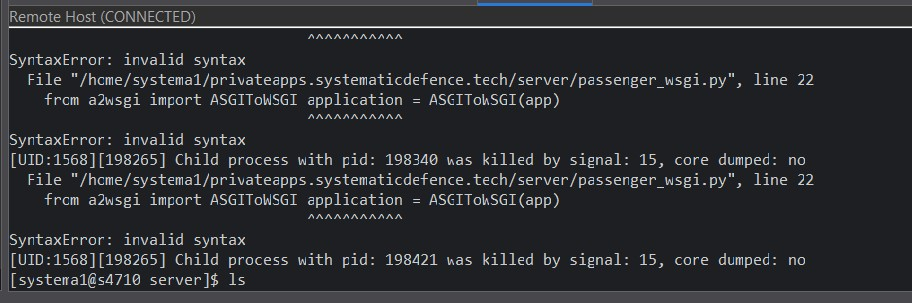
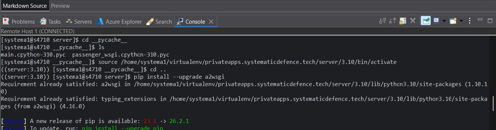

# Sample Python Server

## 1.0 Setup

~/eclipse-workspace/MicronManagement] └─$ python3 -m venv venv

~/eclipse-workspace/MicronManagement] └─$ source venv/bin/activate

~/eclipse-workspace/MicronManagement] └─$ pip install -r requirements.txt

### a. Start server

~/eclipse-workspace/MicronManagement] └─$ uvicorn main:app --reload --port 8002

### b. Acceess virtual environment remotely (if needed)

server] source /home/systema1/virtualenv/privateapps.systematicdefence.tech/server/3.10/bin/activate && cd /home/systema1/privateapps.systematicdefence.tech/server

### b. Test

i. Navigate to :

http://127.0.0.1:8000/api/v1/convert-hex

## 2.0 Versions

### 0.01 Various teething issues as below

Resolved via moving 'application = ASCIToWSGI(app)' to new line.

### 0.02 App using incorrect virtual environment

Issue:

 
Investigation:
 

Resolution:

The console shows that a2wsgi version 1.10.1 is successfully installed in your virtual environment. That version definitely contains ASGIToWSGI, meaning the package itself is fine.
The problem is that  terminal prompt shows virtual environment activated after the error occurred. Passenger (cPanel's application manager) is likely running script using the server's global system Python instead of server's specific virtual environment. When it does that, it falls back to a different or broken version of a2wsgi hosted globally.
So, need to explicitly tell passenger_wsgi.py to use your virtual environment's packages before it tries to import anything.

The Fix:

Open your passenger_wsgi.py file and update Section 2. The standard environment variable check can sometimes fail under Passenger, so should explicitly add the hardcoded path from your terminal screen to sys.path.

Updated code

import sys

import os 

venv_packages = '/home/systema1/virtualenv/privateapps.systematicdefence.tech/server/3.10/lib/python3.10/site-packages'

sys.path.insert(0, os.path.dirname(__file__)) 

venv_packages = '/home/systema1/virtualenv/privateapps.systematicdefence.tech/server/3.10/lib/python3.10/site-packages'
 
sys.path.insert(0, venv_packages)

from main import app 

from a2wsgi import ASGIToWSGI 

application = ASGIToWSGI(app)

### 0.02 App using incorrect virtual environment

Issue:

 
Investigation:

hat command output solves the mystery! The package a2wsgi does not export ASGIToWSGI directly from its main module root in this version. Instead, it exposes ASGIMiddleware and WSGIMiddleware.To convert your ASGI FastAPI application into a WSGI application using this package, you need to use ASGIMiddleware instead.
 
 